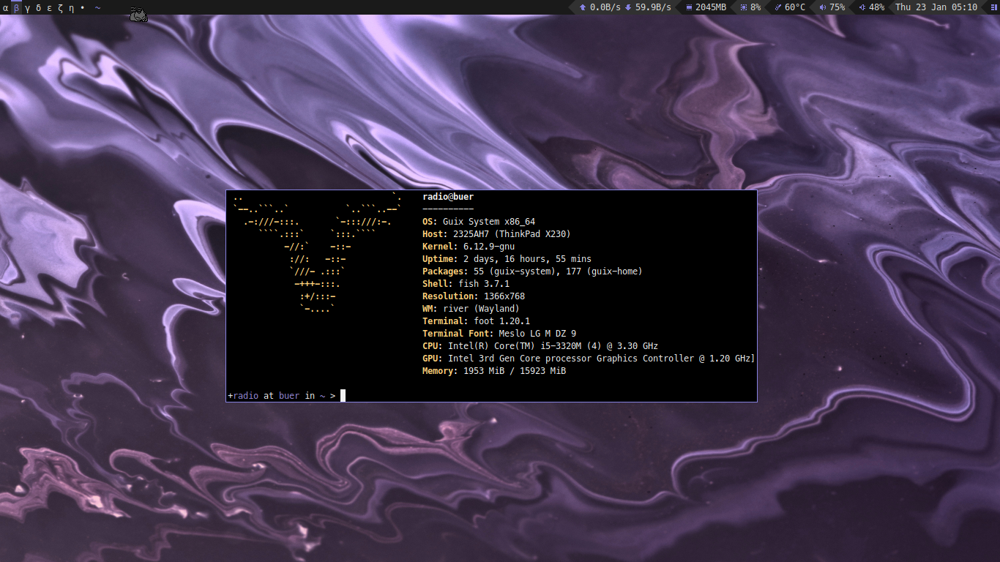
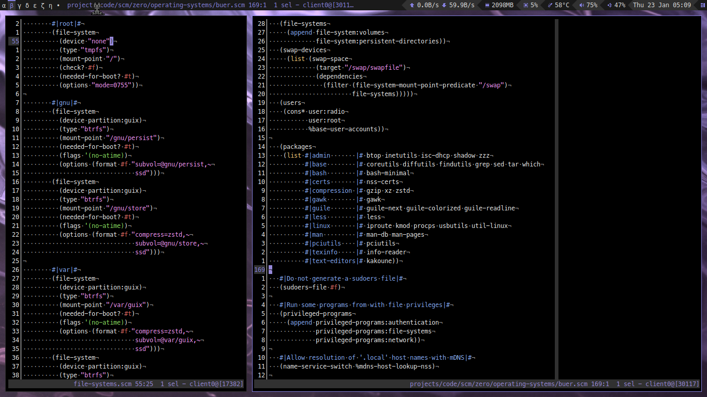

# zero

This repository features my [GNU Guix](https://guix.gnu.org/) configuration and dotfiles.

## Regarding the structure
The configuration herein contained is done in a modular fashion, striving for a proper separation of concerns:
* Operating system configuration (done declaratively using `guix system`);
* Home environment configuration (done declaratively using `guix home`).

Each operating system should provide only the packages, services and other resources needed for the system
installation, proper functioning and administrative tasks. It should avoid to make assumptions regarding the
needs of its users, which should themselves provide the functionality needed by their use through their home
environments configurations. In this sense, no desktop environment, sound backend and other desktop-related
functionality is provided by the systems herein presented. Complementarily, each home environment should make
as little assumptions as possible regarding the operating system it will be used on.

For organization, everything related to a user environment, for example `radio`, should be under
`home-environments/radio/` and `home-environments/radio.scm`. Similarly, everything related to a operating
system, for example `buer`, should be in `operating-systems/buer/` and `operating-systems/buer.scm`.

## Possibly interesting to point out
### Operating Systems
- [buer](https://codeberg.org/anemofilia/zero/src/branch/main/operating-systems/buer.scm)
  * Uses a `tmpfs` root filesystem, a setup known as [impermanence](https://nixos.wiki/wiki/Impermanence), with the intent of extending the
    reproducibility to the system runtime, by deleting on reboot every non explicitly managed state. State
    which is assumed to be unwanted.
  * Uses subvolumes of a single `btrfs` partition for every non-tmpfs filesystem. For the following reasons:
    - compression for `/gnu/store`;
    - snapshots for `/home`;
    - this setup avoids completely the need for partition resizes if the memory usage isn't distributed as
      initially expected.
  * Uses `opendoas-service-type`, available in the [radix channel](https://codeberg.org/anemofilia/radix), for declaratively setting up the rules for
    `doas`, a minimal replacement for `sudo`.
  * Uses `thinkfan-service-type`, available in the radix channel, for thinkpad fan control.
  * No use of `%base-services` or `%base-packages`, every package and service is declared explicitly, since
    it makes more sense to declare what you want than what you don't.

### Home Environments
- [radio](https://codeberg.org/anemofilia/zero/src/branch/main/home-environments/radio.scm)
  * Uses a fork of `home-fish-service-type`, from radix channel, to declaratively setting up the `fish shell`
    configuration, including aliases and plugins.
  * Uses `home-directories-service-type`, from radix channel, to declaratively ensure the existence of certain home subdirectories.
  * Uses `home-repositories-service-type`, from radix channel, to declaratively ensure the existence of certain cloned repositories.
  * Avoid dotfiles by opting for [XDG](https://www.freedesktop.org/wiki/) compliant software, setting environment variables and/or explicitly
    passing configuration files and/or parameters to commands, which are then aliased.
  * Uses the [river](https://codeberg.org/river/river) window manager together with a bar written in [eww](https://elkowar.github.io/eww/eww.html).
    The integration is done with [river-bedload](https://git.sr.ht/~novakane/river-bedload), currently available in the radix channel.
  * Packages are separated in mutiple variables by their functionality scope in the setup.
  * Uses `home-sops-secrets-service-type`, available in the [sops-guix channel](https://github.com/fishinthecalculator/sops-guix), to manage secrets needed
    to ease the usage of the setup.
  * No use of `%base-home-services`, since it makes more sense to declare what you want than what you don't.
  * For anyone looking for dotfiles, these can be found [here](https://codeberg.org/anemofilia/zero/src/branch/main/home-environments/radio/files).

All scheme code in this repository is written with readability in mind, so other users can gather examples
on how to do specific configurations for their own setups. If you have any doubt regarding this repository
files, feel free to open a issue asking about it.
