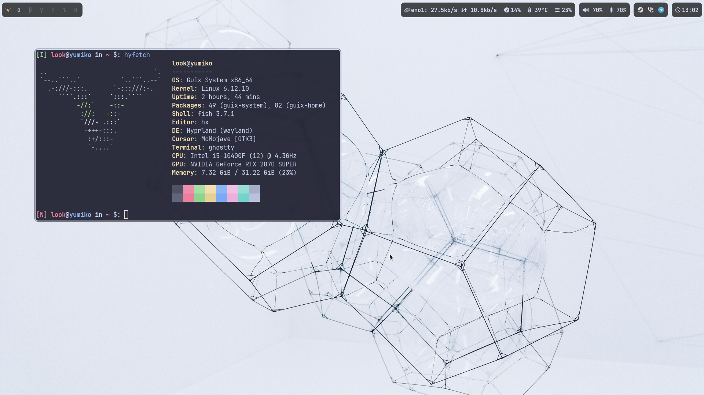

# Misako

My personal repository for storing and sharing my **manifests** and **declarative configuration files** for my **GNU/Guix** operating system.

My **GNU/Guix** channel can be found in [Saayix](https://codeberg.org/look/saayix).

## Configuration files
**Misako** stands as a centralized repository for diverse **configuration files**, spanning both my personal **home** and **system** declarative configurations. It also hosts settings for a variety of applications, all maintained in a **declarative fashion** and automatically updated on reconfigure.

### Home
- look

### System
- yuria (laptop)
- yumiko (desktop, cuirass, guix publish)

### Applications
- aerc
- bemenu (also pinentry)
- doas
- fish
- foot
- git
- helix
- hyfetch
- hyprcursor
- hypridle
- hyprland
- hyprpaper
- hyprsunset
- imv
- mako
- mpv
- obs
- password-store
- senpai
- sioyek
- vesktop
- waybar
- xdg-desktop-portal-hyprland
- yazi
- zen-browser

## Manifests
In addition to configuration files, **Misako** hosts my personal **general manifests** designed for swift `guix shell` development across a variety of programming languages.

- Guile
- Java
- LaTeX
- Python
- Typst
