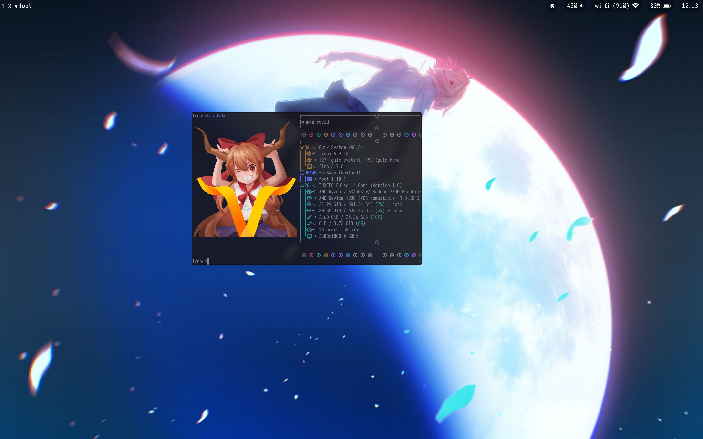

* Galahad
A collection of dotfiles and guile configurations to reproduce any system(s) I have running.
** pure.scm
A collection of variables used to support the following systems and users.
** dotfiles
A folder of configuration files, in the =gnu stow= file format. The structure is as follows:
#+begin_src shell
dotfiles
├── emacs
│  └── .emacs.d
│     ├── config.org
│     ├── custom.el
│     ├── init.el
│     └── README.org -> config.org
├── fastfetch
│  └── .config
│     └── fastfetch
├── fish
│  └── .config
│     └── fish
├── foot
│  └── .config
│     └── foot
├── fuzzel
│  └── .config
│     └── fuzzel
├── git
│  └── .gitconfig
├── sway
│  └── .config
│     └── sway
├── wallpaper
│  └── .bg-moon.png
└── waybar
   └── .config
      └── waybar
#+end_src
** Literate GNU emacs config
I have a literate emacs config you can find at [[./dotfiles/emacs/.emacs.d][dotfiles/emacs/.emacs.d]]
** Systems
*** Arcueid
Arcueid is a laptop running a nonlibre linux kernel for wifi driver support.
- Installation: =sudo guix system reconfigure arcuied.scm -L .=.
** Users
*** Lynn
Lynn is my personal user. It requires nonlibre software such as firefox and steam, for daily
conveniences. It also depends on my personal guix channel, [[https://codeberg.org/lynn_sh/artoria][artoria]].
- Installation: =guix home reconfigure lynn@{system}.scm -L .=.

