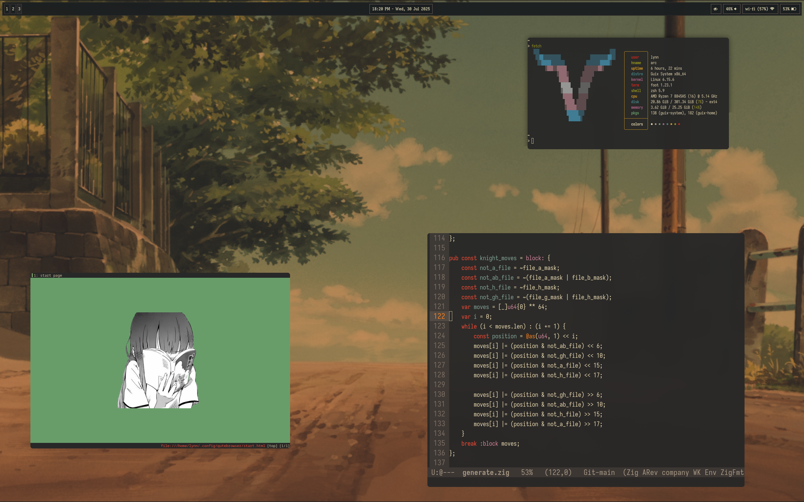

* Galahad
A collection of dotfiles and guile configurations to reproduce any system(s) I have running.
** Literate GNU emacs config
I have a literate emacs config you can find at [[./dotfiles/emacs/.emacs.d][dotfiles/emacs/.emacs.d]]

- Installation: =guix home reconfigure galahad/user/lynn.scm -L.=.

