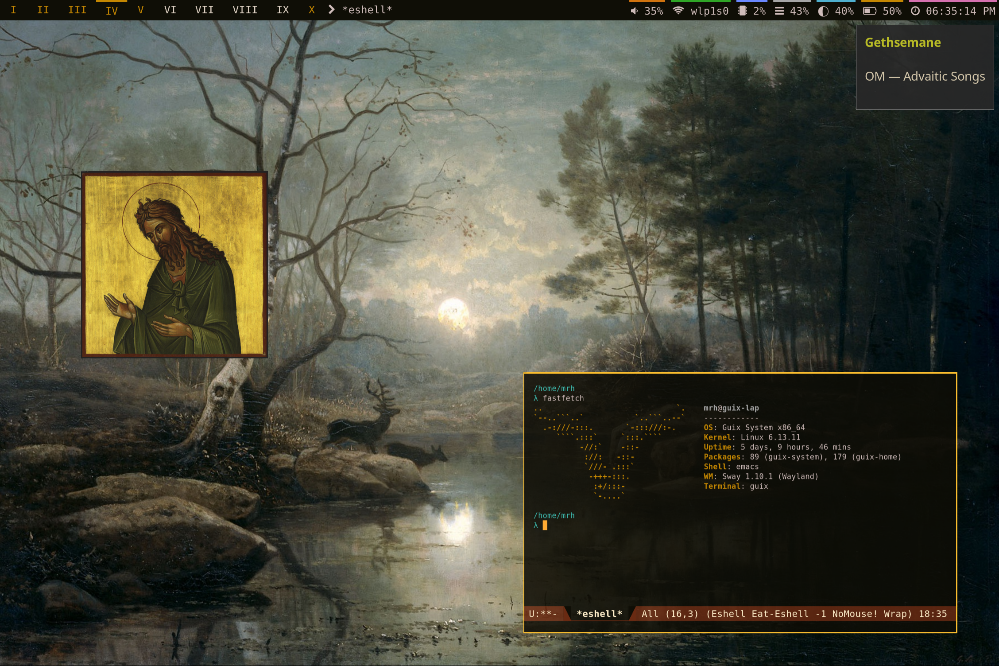

#+author: Alec Barreto
#+options: toc:nil

* Dotfiles
These are the configuration files for my personal guix + emacs setup. Feel free to take anything you find helpful and tell me your thoughts!

#+caption: desktop screenshot

** Free Software
The most important part of my system is that it uses as much [[https://www.gnu.org/philosophy/free-sw.en.html][free software]] as possible.
I also have a fondness for lisp and hackable systems, hence why I control as much of my computing as possible through GNU Guix and Emacs.

My system is not completely free however, as some of my hardware is completely non-functional without proprietary kernel blobs.
I hope hardware manufacturers turn away from this practice.
Those that do would surely have the business of myself and many others.

** Guix
[[https://guix.gnu.org][GNU Guix]] is a purely functional package manager and distribution of the GNU sytsem. It is committed to dependability (unbreakable), hackability, and software freedom.
I run Guix System, but it can also be installed as a standalone package manager on any GNU/Linux distribution.

My system configurations are split up into a base configuration for all machines, and multiple machine-specific configs which inherit that base config.
They can be found at =mrh-guix/system=.

My home configurations are similarly machine specific and can be found at =mrh-guix/home=.
Here is where I setup [[https://guix.gnu.org/manual/en/html_node/Home-Configuration.html][guix home]] to manage all of my user level packages, as well as environment variables and other miscellaneous aspects of my home environment.

Finally, my custom packages which are either not available or more up to date than those in the standard guix repo are available as a [[https://guix.gnu.org/manual/devel/en/html_node/Channels.html][guix channel]] at [[https://codeberg.org/mrh/guix-channel][codeberg.org/mrh/guix-channel]].

** Emacs
[[https://www.gnu.org/software/emacs][GNU Emacs]] is a text editor and lisp interpreter designed to maximize hackability and software freedom, in addition to serving as the primary text editor for the GNU system.

I use emacs for just about everything on my computer other than browsing the web and consuming audio/visual media. This of course includes editing source code, but also:

- [[https://www.gnu.org/software/auctex][AUCTeX]] for writing LaTeX documents
- [[https://www.gnu.org/software/emacs/manual/html_node/emacs/Dired.html][Dired]] for managing files
- [[https://www.gnu.org/software/emacs/manual/html_mono/eshell.html][Eshell]] + [[https://codeberg.org/akib/emacs-eat][Eat]] + =M-&= for shell/terminal
- [[https://github.com/skeeto/elfeed][Elfeed]] for RSS
- [[https://www.gnu.org/software/emacs/erc.html][ERC]] for IRC
- [[https://www.nongnu.org/geiser/][Geiser]] for Guile Scheme hacking
- [[https://magit.vc/][Magit]] for git
- [[https://orgmode.org/][Org Mode]] for so much (including this readme!)
- [[https://www.djcbsoftware.nl/code/mu/][Mu4e]] for email
- [[https://joaotavora.github.io/sly][Sly]] for Common Lisp hacking
- [[https://www.gnu.org/software/tramp/][Tramp]] for remotely accessing machines

All of my emacs packages are installed and managed via guix home (see =Guix= section).

My configuration can be found at =dot-config/emacs/init.org=.
Note that my =init.el= is simply the tangled elisp codeblocks from =init.org=.
